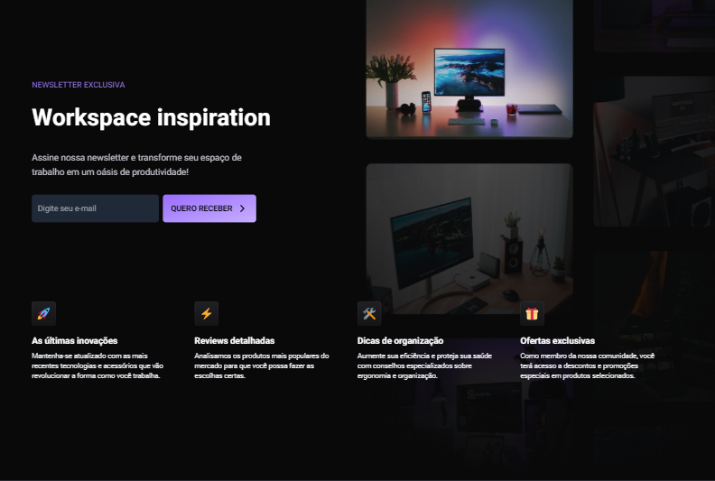

# #BoraCodar - Challenge 40 - NewsLetter

This is a solution to the [NewsLetter](https://www.rocketseat.com.br/boracodar).
## Table of contents
- [#BoraCodar - Challenge 40 - NewsLetter](#boracodar---challenge-40---newsletter)
  - [Table of contents](#table-of-contents)
    - [The Challenge](#the-challenge)
    - [Screenshot](#screenshot)
    - [Links](#links)
    - [Built with](#built-with)
  - [Author](#author)

### The Challenge

Build a SPA (single page application) to serve as inspiration for setups.

### Screenshot

### Links

- Solution URL: [Rocketseat](https://www.rocketseat.com.br/boracodar)
- Live Site URL: [Vercel](https://bora-codar-40-newsletter.vercel.app/)
- Design: [Figma](https://www.figma.com/community/file/1291394985565910709)

### Built with

- Semantic HTML5 markup
- Flexbox
- Components and Props
- [React](https://reactjs.org/) - JS library
- [Next.js](https://nextjs.org/docs) - React framework
- [Tailwindcss](https://tailwindcss.com/) - Css framework
- [Lucide](https://lucide.dev/) - icons library

## Author

- Linkedin - [Renato Rocha](https://www.linkedin.com/in/renato-rrodrigues/)
- Github - [@renatorrocha](https://github.com/renatorrocha)